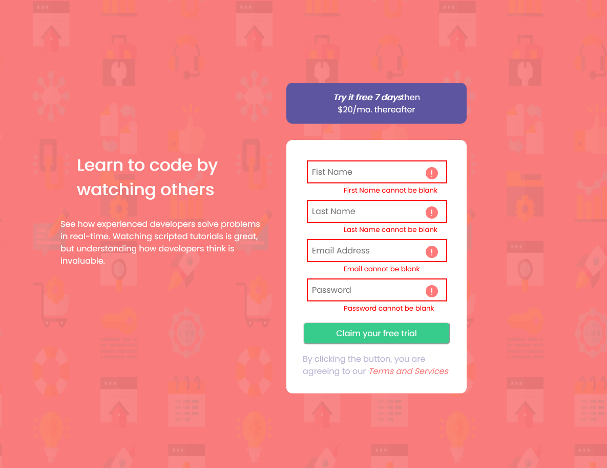
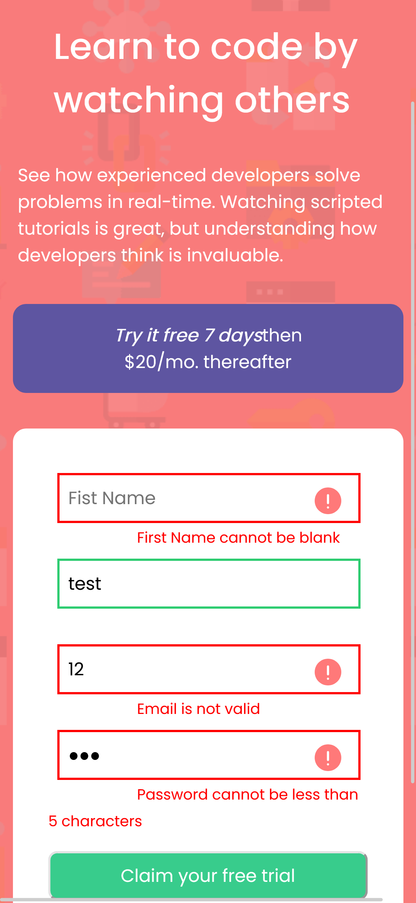

# Frontend Mentor - Intro component with sign up form solution

This is a solution to the [Intro component with sign up form challenge on Frontend Mentor](https://www.frontendmentor.io/challenges/intro-component-with-signup-form-5cf91bd49edda32581d28fd1). Frontend Mentor challenges help you improve your coding skills by building realistic projects.

## Table of contents

- [Overview](#overview)
  - [The challenge](#the-challenge)
  - [Screenshot](#screenshot)
  - [Links](#links)
- [My process](#my-process)
  - [Built with](#built-with)
  - [What I learned](#what-i-learned)
  - [Continued development](#continued-development)
  - [Useful resources](#useful-resources)
- [Author](#author)

## Overview

### The challenge

Users should be able to:

- View the optimal layout for the site depending on their device's screen size
- See hover states for all interactive elements on the page
- Receive an error message when the `form` is submitted if:
  - Any `input` field is empty. The message for this error should say _"[Field Name] cannot be empty"_
  - The email address is not formatted correctly (i.e. a correct email address should have this structure: `name@host.tld`). The message for this error should say _"Email is not valid"_

### Screenshot

### Links

- Solution URL: [Solution](https://www.frontendmentor.io/solutions/form-validation-with-vanilla-js-WU4MrSchV)
- Live Site URL: [Live Site](https://scott-wilder.github.io/)

## My process

### Built with

- Semantic HTML5 markup
- CSS custom properties
- Flex
- Mobile-first workflow
- Vanilla JS

### What I learned

- Client side form validation with JS.
- How to stlye forms with CSS.

### Continued development

Incorporating more JS into my front end projects.

### Useful resources

- [Example resource 1](https://developer.mozilla.org/en-US/docs/Learn/Forms/Form_validation) - This helped me understand the difference between client and server side form validation.
- [Example resource 2](https://www.youtube.com/watch?v=rsd4FNGTRBw&t=1322s) - This is a good video explaining JavaScript Client-side Form Validation.

## Author

- Website - [Scott Wilder](http://www.scott-wilder.com/)
- Frontend Mentor - [@Scott-Wilder](https://www.frontendmentor.io/profile/Scott-Wilder)

